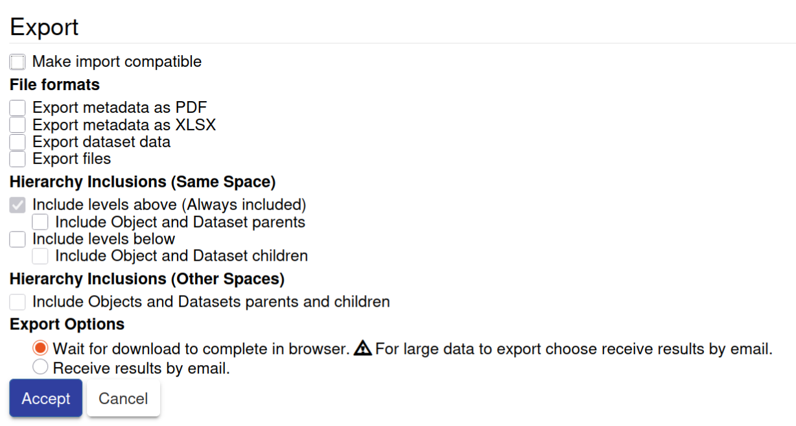

# D1.4 - General documentation and technical specifications of the metadata requirements for automated publishing of FAIR ORD into open repositories

### Authors

- Mihai-Cosmin Danaila (Scientific IT Services, ETH Zurich)
- Adam Laskowski (Scientific IT Services, ETH Zurich)
- Juan Fuentes (Scientific IT Services, ETH Zurich)
- Carlo Pignedoli (Empa)
- Fabio Lopes (Empa)

## Goal

The primary objective of this deliverable was to implement a seamless, automated workflow for the publication of research data, transitioning from an Electronic Lab Notebook (ELN) to a generic data repository. 
For this demonstrator, openBIS was used as the ELN implementation environment, and Zenodo was used as the target repository to ensure long-term data persistence and accessibility.
Building upon the imaging metadata model developed in deliverable D1.1, deliverable D1.4 addresses the critical requirement for data-metadata coupling to ensure scientific reproducibility.
To achieve this, datasets and their corresponding metadata are exported directly from the ELN to the data repository.
The current [openBIS to Zenodo export](https://openbis.readthedocs.io/en/latest/user-documentation/general-users/data-export-to-repositories.html#export-to-zenodo) allows to export metadata in Excel format and pdf.

## Current specifications

[Specification for a scientific metadata model](./lab205-schema-spec.xlsx) in openBIS Excel metadata exchange format, to represent the work done by Work Package 2, currently defines over 80 concepts.

When exporting metadata between systems, it is important to include not only the selected metadata item but also its related context metadata, along with the schema and semantic annotations that describe both the item and its context. To support this, we specify a modal dialog that allows the user to "extend the selection" from a single metadata item to include its contextual metadata.

## Future directions

A key strength of the openBIS Excel metadata exchange format used in deliverable D1.4 is that it includes schema information. Such schema information is essential to make a metadata exchange format machine-actionable and to enable automated discovery and data reusability.

Schema information is frequently missing from many well-known formats. To address this gap, as part of the ETH ORD Domain API01 project we extended the Research Object Crate (RO-Crate) format with additional schema support. The extended format, Ro-Crate Schema+, is backwards compatible with the original RO-Crate specification and is documented [here](https://researchobjectschema.github.io/ro-crate-schema-web/).

Following discussions at the MADICES conference, a whitepaper explaining the Ro-Crate Schema+ format has been published to help the scientific community understand the benefits of including schema information in metadata exchange formats and can be found [here](https://github.com/researchobjectschema/ro-crate-interoperability-profile/blob/main/whitepaper.md).

## References

1. openBIS Excel metadata exchange format: [Documentation](https://openbis.readthedocs.io/en/latest/user-documentation/advance-features/excel-import-service.html#excel-import-service)
2. RO-Crate Schema+: [0.2 Specification](https://github.com/researchobjectschema/ro-crate-interoperability-profile/blob/main/0.2.x/spec.md)